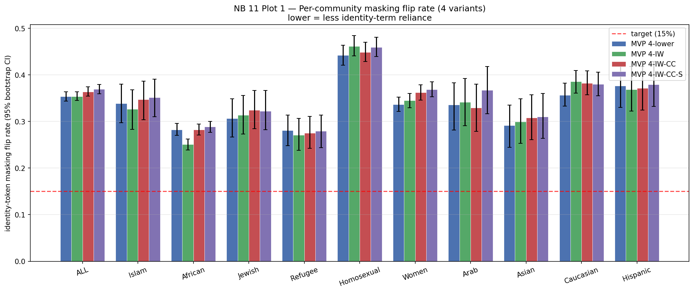

# HateFusion

> Parameter-efficient multimodal hate speech detection on MMHS150K with per-sample interpretability.

[](https://www.python.org/)
[](https://pytorch.org/)
[](https://gombru.github.io/2019/10/09/MMHS/)
[](LICENSE)

## Overview

HateFusion is a gated cross-modal attention architecture that fuses CLIP ViT-B/16 (image), Twitter-RoBERTa (text), and a 9-dimensional structured-feature branch under PEFT LoRA constraints. It targets the documented failure mode in Gomez et al. 2019 where naive multimodal fusion underperforms text-only baselines on MMHS150K, and was developed through a systematic 11-notebook ablation spanning four fusion strategies × two LoRA capacities × two entropy weights × four IW-attention variants. **The headline finding is a clean negative result**: the ~ 0.74 AUC ceiling under PEFT is information-theoretically over-determined across 10+ runs, and the project's named contribution — context-conditioned identity-weighted cross-attention — is shown via bias-off ablation to contribute essentially zero to final predictions. The architectural plumbing introduced alongside the bias term (per-branch LayerNorm + centered VADER modulation) is what carries what modest gains exist over the gated baseline.

## Headline Results

Matched-methodology test-set results across the four MVP 4 variants plus the bias-off ablation, all evaluated on lowercase preprocessing (n = 10,000 test samples / n_t2_valid = 8,411). 95 % bootstrap CIs from 1,000 resamples (seed 42). Source: [`outputs/diagnostic/mvp4_corrected_comparison.md`](outputs/diagnostic/mvp4_corrected_comparison.md).

| Variant | Test AUC [95 % CI] | F1m [95 % CI] | FPR | T2 NotHate F1 [95 % CI] | Gate (t / i / s, H) |
|---|---|---|---:|---|---|
| **MVP 4-lower** (gated baseline) | 0.7358 [0.7253, 0.7456] | 0.6867 [0.6772, 0.6956] | 0.2921 | 0.2692 [0.2559, 0.2829] | 0.450 / 0.062 / 0.489, H = 0.845 |
| MVP 4-IW (NB 09) | 0.7359 [0.7258, 0.7459] | 0.6876 [0.6780, 0.6965] | 0.2857 | 0.3378 [0.3237, 0.3528] | 0.374 / 0.299 / 0.327, H = 1.073 |
| MVP 4-IW-CC (NB 09b) | 0.7340 [0.7241, 0.7437] | 0.6882 [0.6790, 0.6971] | 0.2981 | 0.5154 [0.5011, 0.5287] | 1.000 / 0.000 / 0.000, H = 0.000 |
| **MVP 4-IW-CC-S (NB 09c)** | **0.7359** [0.7256, 0.7458] | **0.6889** [0.6797, 0.6979] | 0.3011 | **0.5791** [0.5663, 0.5930] | 0.467 / 0.219 / 0.315, H = 1.029 |
| IW-CC-S-bias-off (λ_id = 0) | 0.7359 [0.7256, 0.7458] | 0.6888 [0.6796, 0.6979] | 0.3013 | 0.5789 [0.5661, 0.5930] | 0.467 / 0.219 / 0.315, H = 1.029 |



- **The ~ 0.74 AUC ceiling holds across all variants** — within the bootstrap CI band of the four-run MVP 1 diagnostic ([Phase 2 § 11](Reports/Phase2_Modeling_Report.md)). Under PEFT LoRA on `cardiffnlp/twitter-roberta-base-2022-154m` for MMHS150K T1, this ceiling appears information-theoretic, not optimisation-limited.
- **The IW bias mechanism contributes Δ ≈ +0.0002 to T2 NotHate F1.** The bias-off ablation (same NB 09c weights with `λ_id = 0` at inference) matches the full IW-CC-S to four decimal places on every aggregate metric and disagrees on **1 out of 10,000 test samples** ([Phase 3 § 6](Reports/Phase3_Analysis_Report.md)).
- **The architectural plumbing carries what gains exist.** Per-branch LayerNorm before gate concatenation + centered VADER modulation jointly resolve the gate-collapse-via-magnitude-mismatch failure mode documented in NB 09b (test gate entropy 0.000 → 1.029).
- **Bias robustness requires dataset-level intervention, not architecture-level.** All four variants flip ≈ 35 % of identity-laden samples when the identity tokens are masked — roughly 2× the 15 % design target. Counterintuitively, MVP 4-IW-CC-S has the *highest* flip rate (0.3691) of the four (NB 11).

## Key Findings

1. **The ~ 0.74 LoRA PEFT ceiling is characterised across 10+ runs** spanning four fusion strategies (text-only / naive concat / three-branch naive / gated), two LoRA capacities (rank 32 / rank 64), and two entropy weights (0.01 / 0.05). Test AUC range across all runs: 0.7340 – 0.7431.
2. **Gate-collapse-via-magnitude-mismatch diagnosis + per-branch LayerNorm fix** (NB 09b → NB 09c trajectory). Documented as a reusable architectural pattern: any gated multimodal fusion where branch outputs have heterogeneous magnitudes can collapse onto the most magnitude-stable branch.
3. **Per-sample modality reliance taxonomy** (NB 10) — five categories (*Convergent Correct / Text Saved / Image Saved / Emergent Multimodal / Fusion Failure*, plus *Struct Saved* sub-bucket) operationalised via one-hot gate substitution. Reveals that aggregate AUC parity across variants conceals near-identical per-sample behaviour (> 97 % cross-variant agreement).
4. **Bias-off ablation methodology** — zero a single attention term at inference, re-evaluate the full test set, compare per-sample agreement. Documented in [Phase 3 § 6](Reports/Phase3_Analysis_Report.md) and reusable for any single-term-attention contribution claim.
5. **Case-preprocessing diagnostic** — when chaining a frozen pretrained encoder with downstream trainable modules, mismatched input preprocessing (e.g., lowercasing input to a case-sensitive frozen encoder) puts the encoder out-of-distribution at the very first layer and confounds cross-variant comparisons. See [`outputs/diagnostic/nb08_vs_nb10_audit.md`](outputs/diagnostic/nb08_vs_nb10_audit.md).
6. **Honest negative result on identity-weighted cross-attention.** Keyword-based identity priors did not improve multimodal hate speech detection under any of the four tested architectures. The result is documented rather than hidden behind aggregate-metric framing, with the diagnostic infrastructure preserved for future variants.

## Architecture

The production architecture is **MVP 4-IW-CC-S** (NB 09c). Frozen MVP 2 components are shown in `[F]`; trainable components in `[T]`.

```
Text       input_ids ───► [F] Twitter-RoBERTa + Run-D LoRA (rank 32) ──► text_tokens (B, 128, 768)
                                                                   └─►  text_cls   (B, 768)
Image      pixel_values ─► [F] CLIP ViT-B/16 + MVP-2 LoRA ─► visual_projection_to_512 (768→512)
                                                          └─► image_projection (512→768) ──► img_768 (B, 768)
Struct     9 features ──► [T] Linear(9, 32) + ReLU + Dropout ─────────────────────────────► struct_embed (B, 32)

   Cross-attention (image queries text tokens), trainable:
       q = img_768.unsqueeze(1) ──► [T] IWCCSMultiheadAttention(num_heads=8) ─────► attn_out (B, 768)
                                          │
                            logits = (Q@K^T)/√d_k + λ_id · identity_mask
                                                   · (1 + α · vader_neg_centered)
                                          │
       attended_img = [T] LayerNorm(img_768 + attn_out)  (B, 768)

   Gate input (per-branch LayerNorm, then concat):
       [T] gate_ln_text(text_cls) ── [T] gate_ln_image(attended_img) ── [T] gate_ln_struct(struct_embed)
                                          │
       gate_logits ── [T] Linear(1568, 3) ──► softmax ──► gates (B, 3) = [g_text, g_image, g_struct]

   Gated fusion in shared 256-d space:
       fused = g_text · [T] proj_text(text_cls)
             + g_image · [T] proj_image(attended_img)
             + g_struct · [T] proj_struct(struct_embed)            (B, 256)
                                          │
                       [T] head_t1 (Linear→ReLU→Dropout→Linear) ──► logits_t1 (B, 1)   ← binary hate
                       [T] head_t2 (Linear→ReLU→Dropout→Linear) ──► logits_t2 (B, 6)   ← T2 multiclass
```

The identity-bias term `λ_id · identity_mask · (1 + α · vader_neg_centered)` was tested but shown via bias-off ablation to contribute negligibly to final predictions ([Phase 3 § 6](Reports/Phase3_Analysis_Report.md)). The architectural improvements (per-branch LayerNorm + centered VADER modulation) are what carry the lift over MVP 4-IW. See [Phase 2 § 16c](Reports/Phase2_Modeling_Report.md) for the architectural progression NB 09 → NB 09b → NB 09c and the post-hoc correction.

## Repository Structure

```
HateFusion/
├── notebooks/      20 executed notebooks (data → modeling → analysis)
├── models/         Trained checkpoints (weights .pt/.safetensors not tracked)
├── data/processed/ Identity lexicon + per-sample analytical parquets
├── outputs/        Charts, tables, diagnostic reports
├── Reports/        Phase 1 / 2 / 3 reports + identity-lexicon docs
└── requirements.txt
```

## Reports

Full project documentation lives in the three phase reports:

- **[Phase 1 — Data Engineering](Reports/Phase1_Data_Engineering_Report.md)** — label parsing, structured feature engineering, EDA, train / val / test splits
- **[Phase 2 — Modeling](Reports/Phase2_Modeling_Report.md)** — MVP ladder (text-only → gated multimodal), IW family architectural progression (NB 09 → NB 09b → NB 09c), rank-64 ablation, entropy ablation, NB 09c matched-methodology post-hoc correction (§ 16c.12)
- **[Phase 3 — Analysis](Reports/Phase3_Analysis_Report.md)** — per-sample modality reliance taxonomy (NB 10), bias-off ablation, identity-term masking, counterfactual swap test, per-community performance stratification (NB 11)
- **[Identity Lexicon Build Report](Reports/Identity_Lexicon_Build_Report.md)** — HateXplain-derived 1,177-token lexicon with Hatebase overlap audit

## Notebook Pipeline

- **Phase 1 (Data Engineering)**: `01_data_loading` · `02_eda` · `03_structured_features`
- **Phase 2 (Modeling)**: `04_roberta_pretrain_kaggle` (Twitter-RoBERTa warm-start) · `05d_rank32_lr3e4` (MVP 1 baseline, Run D) · `05_mvp1_rank64` (capacity ablation) · `06_mvp2_naive_fusion` · `06_mvp2_rank64` · `07_mvp3_three_branch_fusion` · `07_mvp3_rank64` · `08_mvp4_gated_fusion` · `08_mvp4_rank64` · `08b_mvp4_entropy_ablation` · `08_lower_mvp4_lowercase` (auxiliary retrain for matched-methodology) · `09_mvp4_iw_attention` · `09b_mvp4_iwcc_attention` · `09c_mvp4_iwccs_attention`
- **Phase 3 (Analysis)**: `10_per_sample_modality_analysis` · `10_lower_per_sample_modality_analysis` · `11_bias_analysis`

Each notebook is self-contained and re-runnable; see the relevant Phase report for findings and decisions locked at each step.

## Quick Start

```bash
git clone https://github.com/devAbdelrahman-Elgewily/HateFusion.git
cd HateFusion
conda create -n hatefusion python=3.11
conda activate hatefusion
pip install -r requirements.txt
jupyter lab
```

Notebooks 01 → 11 form the pipeline; each notebook documents its inputs, hparams, and outputs in the first markdown cell.

## Dataset Setup

The smaller text / tabular files (identity lexicon, MMHS150K split definitions, per-sample analytical parquets) are tracked in this repository. The two image datasets — MMHS150K (≈ 6 GB) and Hateful Memes (≈ 3 GB) — must be downloaded separately. See [`data/README.md`](data/README.md) for download instructions and the expected directory layout. The Cyberbullying Tweets dataset used for the Twitter-RoBERTa warm-start (NB 04) is downloadable from Kaggle and is **not** committed.

## Reproducibility

All experiments use seed 42 throughout (`random`, `numpy`, `torch`, `torch.cuda`). Official MMHS150K splits are used as-is — train 134,820 / val 4,999 / test 10,000 — for direct comparability with Gomez et al. 2019. Val and test are 50 / 50 hate-balanced by dataset design (Gomez 2019); train follows the natural ~ 22 % hate rate. Bootstrap CIs in all reports use 1,000 resamples with seed 42.

## Ethics & Limitations

- **English Twitter only.** Does not generalise to other languages or platforms without re-training and a re-derived identity lexicon.
- **Inherits MMHS150K biases.** Known keyword-sampling bias (Davidson et al. 2019) and annotator inconsistency (Sap et al. 2019) propagate into the model.
- **Identity-masking bias-robustness threshold not met.** All four architectural variants tested exceed the 15 % identity-term-masking flip-rate threshold by ≈ 2× ([Phase 3 § 10.3](Reports/Phase3_Analysis_Report.md)). Bias-robustness improvements require dataset-level interventions (re-balanced training data, identity-token augmentation, counterfactual augmentation), not architecture changes.
- **Academic research artefact, not for production.** No deployment claims. Identity-bias mechanism shown via bias-off ablation to be non-contributory — do not deploy variants under a "context-conditioned identity-aware moderation" framing.
- **Identity lexicon derived from HateXplain** may not transfer to other datasets without community-specific adjustments.

## Citation

```bibtex
@misc{hatefusion2026,
  title  = {HateFusion: Multimodal Hate Speech Detection via Gated Cross-Modal Attention on MMHS150K},
  author = {Abdelrahman Elgewily},
  year   = {2026},
  url    = {https://github.com/devAbdelrahman-Elgewily/HateFusion}
}
```

### Key References

```bibtex
@inproceedings{gomez2020exploring,
  title     = {Exploring Hate Speech Detection in Multimodal Publications},
  author    = {Gomez, Raul and Gibert, Jaume and Gomez, Lluis and Karatzas, Dimosthenis},
  booktitle = {WACV},
  year      = {2020}
}

@inproceedings{mathew2021hatexplain,
  title     = {HateXplain: A Benchmark Dataset for Explainable Hate Speech Detection},
  author    = {Mathew, Binny and Saha, Punyajoy and Yimam, Seid Muhie and Biemann, Chris and Goyal, Pawan and Mukherjee, Animesh},
  booktitle = {AAAI},
  year      = {2021}
}

@inproceedings{hu2022lora,
  title     = {LoRA: Low-Rank Adaptation of Large Language Models},
  author    = {Hu, Edward J. and Shen, Yelong and Wallis, Phillip and Allen-Zhu, Zeyuan and Li, Yuanzhi and Wang, Shean and Wang, Lu and Chen, Weizhu},
  booktitle = {ICLR},
  year      = {2022}
}
```

## License

MIT — see [LICENSE](LICENSE) for details. Dataset usage is subject to the original dataset licenses; this codebase's MIT license does not grant rights to the underlying data.
